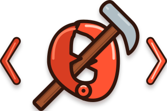

<p align="center">
  
</p>

<h1 align="center">nilchela</h1>

<p align="center"><strong>"the empty claw, equipped."</strong></p>

---

A thin, development-enabled image for [ZeroClaw](https://github.com/zeroclaw-labs/zeroclaw) agents — the official base plus a clean pattern for provisioning language toolchains *at runtime* instead of baking them in, built on `build-essential` and the `mise` version manager.

Built with ❤️ by [rawlink](https://github.com/rawlink) on the official [ZeroClaw](https://github.com/zeroclaw-labs/zeroclaw) base image (MIT OR Apache-2.0). nilchela is an independent community project and is not affiliated with or endorsed by ZeroClaw Labs.

---

## Why this exists

The official ZeroClaw image (`ghcr.io/zeroclaw-labs/zeroclaw`) is deliberately minimal — a lean agent host with `bash`, `git`, `curl`, and nothing else. That's the right call for its job (small attack surface).

But an agent that needs to *build* things — run `cargo`, `go`, `node`, `python` — has no toolchain. Baking those in creates a ~3 GB image that rebuilds on every version bump and pulls slowly.

**nilchela decouples the two.** It layers `mise` + OS build tools on the base, then installs pinned toolchains into a mounted volume at container start. The result:

| | Baked-in toolchains | nilchela |
|---|---|---|
| Image size | ~3 GB | ~300 MB |
| Version bump | full rebuild + re-pull | edit `mise.toml` + roll |
| Non-root posture | often broken | preserved (`USER 65534`) |
| Toolchain set | fixed at build | configurable per-deploy |

---

## How it works

1. **Build a thin image** — OS tooling + the `mise` CLI. No toolchains.
2. **Pin tools in `mise.toml`** — exact versions for `go`, `node`, `python`, `rust`, `uv`, `gh`, and runtime env (build-cache locations). See [`mise.toml.example`](mise.toml.example).
3. **Install at start** — an initContainer runs `mise install` into a mounted `/tools` volume (root-owned). `mise` is address-and-skip: a warm volume starts near-instantly, offline-quiet.
4. **Run non-root** — the agent container mounts `/tools` read-only and invokes tools via shims on `PATH`.
5. **Enter through `mise exec`** — the image overrides the base `ENTRYPOINT`, so the daemon starts as `mise exec -- /usr/local/bin/zeroclaw daemon` and inherits the full mise environment: `PATH` assembled from the shims and the active tool directories, plus every `[env]` variable from `mise.toml`. There is deliberately **no baked `PATH`** and no wrapper script — `mise exec` is the primitive. If you replace the entrypoint, you own this: source `mise env` yourself, or the child process sees no toolchain.

---

## What's included

**OS-level (apt):** `build-essential`, `pkg-config`, `ca-certificates`, `curl`, `jq`, `git-lfs`, `openssh-client`, `unzip`, `xz-utils` — layered on the base's `bash`/`git`/`curl`.

**Runtime toolchains (via `mise`, configurable):** nothing is baked in. You pin the set you want in your `mise.toml` (Go, Node, Python, Rust with `rustfmt` + `clippy`, `uv`, the GitHub CLI, …) — add/remove tools there without touching the image.

---

## Getting Started

### Prerequisites

- Docker (with BuildKit, default in Docker 23+ / recent Docker Desktop)
- Network access to `ghcr.io` (to pull the ZeroClaw base)

### 1. Build the image

Run the following from the repository root — the trailing `.` is the build context.

```bash
docker build \
  -f Dockerfile \
  -t nilchela:dev \
  .
```

Override the base version or mise version via build args:

```bash
docker build \
  -f Dockerfile \
  --build-arg ZEROCLAW_VERSION=0.8.5 \
  --build-arg MISE_VERSION=v2026.9.3 \
  -t nilchela:dev \
  .
```

### 2. Emulate the pod locally

The pod model has three volumes (`/tools`, `/cache`, `/config`) and a non-root user. Emulate it locally to catch the permission model before it hits the cluster.

Start from the pinned example and fill in real versions:

```bash
cp mise.toml.example mise.toml   # then replace every <version>
```

Then:

```bash
# Volumes
docker volume create zc-tools
docker volume create zc-cache

# Emulate pod ownership — chown the cache so the non-root agent can write it
docker run --rm -v zc-cache:/cache busybox chown -R 65534:65534 /cache

# Stage mise.toml (substitute for the ConfigMap)
mkdir -p /tmp/zc-pod/config && cp mise.toml /tmp/zc-pod/config/

# "initContainer" — install pinned toolchains into /tools
docker run --rm \
  -e MISE_DATA_DIR=/tools \
  -e MISE_GLOBAL_CONFIG_FILE=/config/mise.toml \
  -e MISE_TRUSTED_CONFIG_PATHS=/config \
  -e MISE_CACHE_DIR=/cache/mise \
  --entrypoint mise \
  -v zc-tools:/tools -v zc-cache:/cache -v /tmp/zc-pod/config:/config \
  nilchela:dev install

# "main container" — verify tools resolve through shims (read-only /tools)
docker run --rm \
  -e MISE_DATA_DIR=/tools \
  -e MISE_GLOBAL_CONFIG_FILE=/config/mise.toml \
  -e MISE_TRUSTED_CONFIG_PATHS=/config \
  -e PATH="/tools/shims:/usr/local/sbin:/usr/local/bin:/usr/sbin:/usr/bin:/sbin:/bin" \
  --entrypoint /bin/bash \
  -v zc-tools:/tools:ro -v zc-cache:/cache -v /tmp/zc-pod/config:/config:ro \
  nilchela:dev -lc 'which go cargo node python uv gh && go version && cargo --version'
```

### 3. Deploy to Kubernetes

This repo intentionally ships **only the image recipe** — your cluster's manifests (StatefulSet, PVCs, the `mise.toml` ConfigMap) belong in your own infra repo, where they can reference your namespace, storage classes, and registry.

The deployment shape in summary:

- **An initContainer** runs `mise install` (root) to populate a `/tools` volume from your pinned `mise.toml`.
- **A second initContainer** `chown`s the shared `/cache` volume to `65534:65534`.
- **The agent container** runs non-root (`65534`), mounts `/tools` read-only, and gets its toolchain env from shims + `mise.toml`'s `[env]`.

> **Requirement:** provision a `zeroclaw-tools` (≈10 GB) and a bounded `zeroclaw-cache` PVC, and render your `mise.toml` into a ConfigMap mounted at `/config`. The deployment deliberately uses **no `fsGroup`** — split ownership (tools → root, cache → `65534`) is done by initContainer `chown`.

---

## Configuration

### `mise.toml` — the single source of truth

All tool versions and runtime env live in a `mise.toml` (rendered into a ConfigMap at deploy time; use [`mise.toml.example`](mise.toml.example) as your starting point). Key sections:

- **`[tools]`** — exact-pinned tool versions. Bump one, and only the delta downloads on next start.
- **`[env]`** — toolchain runtime vars (build-cache locations). Kept here — **not** in the Dockerfile — so the image stays decoupled from the toolchain set.

> **Why this split?** `mise` reads its own bootstrap env (`MISE_DATA_DIR`, `MISE_GLOBAL_CONFIG_FILE`, etc.) at process start, before it can read `mise.toml` — so those live in the Dockerfile as `ENV`. Toolchain runtime env (`CARGO_HOME`, `GOMODCACHE`, …) is surfaced via `mise env`/shims and lives in `[env]`. The cache-redirect entries are deliberate policy (keep caches off `/zeroclaw-data`), not boilerplate — `mise` can't infer them.

### Generating the environment dynamically

Rather than hand-enumerating env vars, mise can emit the full environment it knows (PATH + `[env]` + tool/plugin-set vars) in one shot:

```bash
eval "$(mise env -s bash)"       # sourceable shell form
mise env --dotenv > .env         # dotenv form
mise env --json                  # json form
```

In the nilchela container this is not required — shims already surface `[env]` to child processes, and `PATH` is set in the image — but it's the lever if you want to source everything dynamically instead of relying on the baked `PATH`.

### Storage model

| Path | Purpose | Ownership | Lifecycle |
|---|---|---|---|
| `/tools` | installed toolchains | root (RO to agent) | durable, shared |
| `/cache` | build caches (cargo/go/npm/uv) | 65534 | disposable |
| `/config` | `mise.toml` (ConfigMap) | — | GitOps-tracked |
| `/zeroclaw-data` | repos/workspaces/notes | 65534 | durable |

Build caches are redirected off the durable data volume precisely so it doesn't balloon with disposable registries.

---

## Publishing

The image is published to **GitHub Container Registry** (`ghcr.io/infiniteprimates/nilchela`) via [`.github/workflows/build-publish.yaml`](.github/workflows/build-publish.yaml):

- **Auto-created** — GHCR creates the package on first push. It defaults to **private**; set its visibility to "public" in the GHCR package settings to publish it.
- **Multi-arch** — native `linux/amd64` + `linux/arm64` via buildx.
- **Tags** — semver tags (`v*`), and SHA; `latest` on the default branch.

To publish, push to `main` or push a `v*` tag. No registry secret is needed — the workflow's `permissions: packages: write` grants what `GITHUB_TOKEN` requires.

> For a *different* registry (self-hosted Harbor, Docker Hub, etc.), swap the `registry`/`username`/`password` in the login step and add its credentials as a secret.

---

## License

MIT (see [LICENSE](LICENSE)). This project layers on the [ZeroClaw](https://github.com/zeroclaw-labs/zeroclaw) base image (MIT OR Apache-2.0) and [mise](https://github.com/jdx/mise) (MIT).

---

## Contributing

PRs welcome. Keep the two design invariants intact:

1. **Thin image** — no toolchains baked in; they install at runtime via `mise`.
2. **Non-root** — always return to `USER 65534` after any root-only install steps.

See [CONTRIBUTING.md](CONTRIBUTING.md) for the full guide. The code of conduct is in [CODE_OF_CONDUCT.md](CODE_OF_CONDUCT.md), and the security policy in [SECURITY.md](SECURITY.md).

The key design decisions (the `[tools]` vs `[env]` split, storage tiers, the no-`fsGroup` ownership model) are explained inline in [`Dockerfile`](Dockerfile) and this document.
